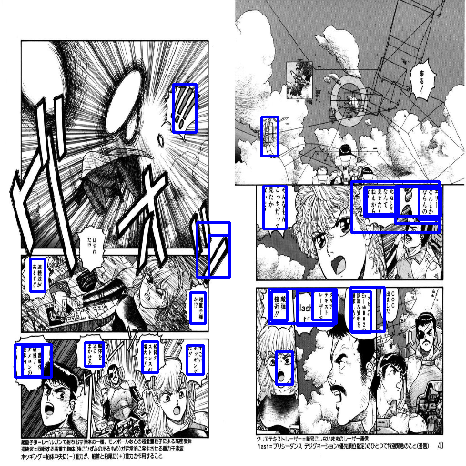

# speech-bubble-extraction
 Extracting the text from speech bubbles from manga

After training the efficientdet for 3 epochs on the Manga109 dataset

</img>

## Credits

I am using the scripts in src folder from signatrix implementation of efficientdet which is available <a href="https://github.com/signatrix/efficientdet"> here </a>  
I also used the <a href="https://github.com/manga109/manga109api">manga109api </a> to save time on parsing the manga109 dataset

## To do
<ul>
 <li>Extracting text from the detected speech bubbles text</li>
 <li> Enhancing the text containing parts of the image using morphological operations for improving the OCR's performance </li>
</ul>
