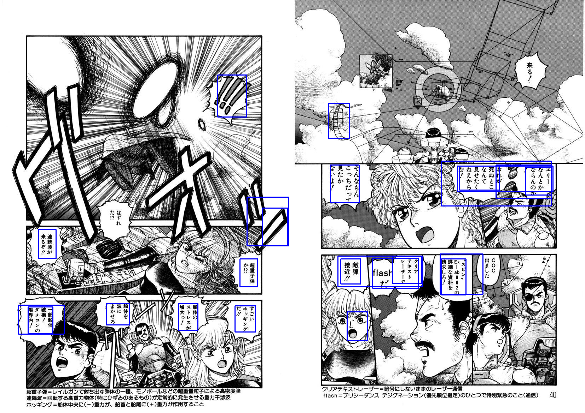

# speech-bubble-extraction
 Extracting the text from speech bubbles from manga
 
 A page can be translated by running the below commamd
```
python easyocr_translate.py --img_path IMG_PATH --out_path OUT_PATH
```

<strong> Its a work in progress, the quality of cleaning and translation is very poor</strong>

## Sample Output

After training the efficientdet for 3 epochs on the Manga109 dataset <br>

</img>

Google translation with easyocr <br>

<div class="row">
  <div class="column">
    
  </div>
  <div class="column">
    
  </div>
</div>


## Credits

I am using the scripts in src folder from signatrix implementation of efficientdet which is available <a href="https://github.com/signatrix/efficientdet"> here </a> <br>
I also used the <a href="https://github.com/manga109/manga109api">manga109api </a> to save time on parsing the manga109 dataset

## To do
<ul>
 <li> Enhancing the text containing parts of the image using morphological operations for improving the OCR's performance </li>
 <li> Improve Cleaning </li>
 <li> Improve text placement </li>
</ul>
